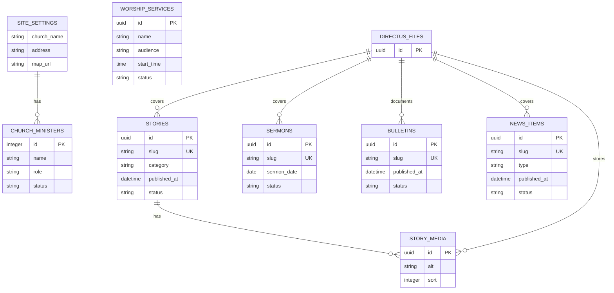

# 교회 홈페이지 프로젝트

처음 교회를 알아보는 사람이 교회의 성격과 분위기를 이해하고, 예배 시간과 방문 방법을 빠르게 확인할 수 있도록 만드는 방문자 중심의 교회 홈페이지입니다.

## 프로젝트 목표

방문자가 1분 안에 다음 질문에 답을 얻을 수 있어야 합니다.

- 어떤 가치와 분위기를 가진 교회인가?
- 언제, 어디에서 예배하는가?
- 실제 공동체의 모습은 어떠한가?
- 처음 방문할 때 무엇을 알고 가야 하는가?
- 궁금한 점은 어디로 문의할 수 있는가?

## 핵심 사용자 흐름

```text
검색 또는 공유 링크로 유입
  → 교회의 첫인상과 핵심 가치 확인
  → 실제 활동과 설교를 통해 분위기 탐색
  → 예배 시간과 위치 확인
  → 방문 결정 또는 문의
```

## 제품 원칙

- 내부 조직보다 처음 방문하는 사람의 질문을 우선합니다.
- 많은 메뉴를 나열하기보다 중요한 정보가 자연스럽게 이어지게 합니다.
- 추상적인 문구보다 실제 사진과 구체적인 설명을 사용합니다.
- 모바일에서 예배 시간, 위치, 연락처를 쉽게 확인할 수 있어야 합니다.
- 관리자는 정해진 양식에 콘텐츠만 입력해도 일관된 화면을 만들 수 있어야 합니다.

## 예상 메뉴

- 교회 소개
- 교회 이야기
- 주보·소식
- 설교

예배 시간과 위치는 홈에서 바로 확인할 수 있으며, `처음 오셨나요?` 버튼으로 홈 예배시간 영역에 연결됩니다.

홈은 최근 이야기와 주보의 미리보기만 보여주고, 계속 쌓이는 기록은 별도 목록 화면에서 탐색합니다.

## 문서

- [제품 및 UX 기획서](docs/PRODUCT_SPEC.md)
- [콘텐츠 모델 초안](docs/CONTENT_MODEL.md)
- [Directus SQLite 데이터 모델](docs/DATA_MODEL.md)
- [Codex 작업 지침](AGENTS.md)

## Directus SQLite 데이터 모델

공개 웹은 SQLite를 직접 조회하지 않고 Directus API에서 `published` 콘텐츠만 읽습니다. 필드 정의와 공개 역할 정책은 [데이터 모델 문서](docs/DATA_MODEL.md)를 기준으로 합니다.



## 데모 실행

공개 웹은 Next.js App Router와 TypeScript로 이전 중입니다. 기존 정적 데모는 시각·콘텐츠 흐름 참고용으로 남겨 두며, 공개 경로는 Next.js에서 제공합니다.

```bash
npm install
npm run dev
```

브라우저에서 <http://localhost:3000>으로 접속합니다.

교회명은 `글로벌교회(Global Community Church)`로 반영했습니다. 주소는 `경기도 시흥시 하상로8번길 12-1`로 반영했으며, 이야기와 주보는 사이트 내부 상세 화면에서 확인할 수 있습니다. 예배 시간·연락처·설교 정보는 실제 운영 전에 확인해야 합니다.

## 현재 상태

Next.js 전환 기반을 마련한 단계입니다. Directus CMS, 실제 교회 정보와 콘텐츠 운영 정책은 후속 이슈에서 연결합니다.

## 참고 사이트

- [사랑의교회](https://www.sarang.org/)
참고 사이트에서는 설교, 예배 시간, 주보, 새가족, 오시는 길 등 필요한 콘텐츠의 종류를 참고합니다. 다만 대형 교회 포털에 가까운 복잡한 메뉴 구조는 따르지 않고, 더 간결하고 현대적인 방문자 중심 UX로 재구성합니다.
