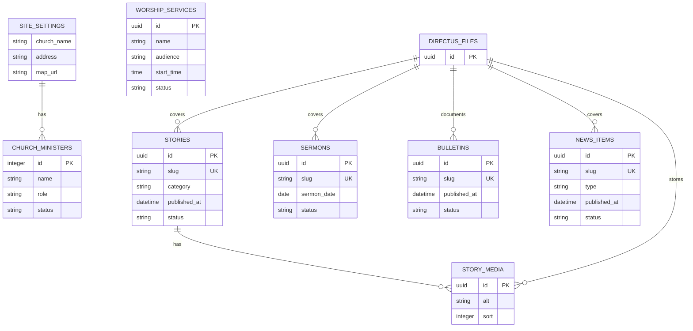

# 교회 홈페이지 프로젝트

처음 교회를 알아보는 사람이 교회의 성격과 분위기를 이해하고, 예배 시간과 방문 방법을 빠르게 확인할 수 있도록 만드는 방문자 중심의 교회 홈페이지입니다.

## 프로젝트 목표

방문자가 1분 안에 다음 질문에 답을 얻을 수 있어야 합니다.

- 어떤 가치와 분위기를 가진 교회인가?
- 언제, 어디에서 예배하는가?
- 실제 공동체의 모습은 어떠한가?
- 처음 방문할 때 무엇을 알고 가야 하는가?
- 궁금한 점은 어디로 문의할 수 있는가?

## 핵심 사용자 흐름

```text
검색 또는 공유 링크로 유입
  → 교회의 첫인상과 핵심 가치 확인
  → 실제 활동과 설교를 통해 분위기 탐색
  → 예배 시간과 위치 확인
  → 방문 결정 또는 문의
```

## 제품 원칙

- 내부 조직보다 처음 방문하는 사람의 질문을 우선합니다.
- 많은 메뉴를 나열하기보다 중요한 정보가 자연스럽게 이어지게 합니다.
- 추상적인 문구보다 실제 사진과 구체적인 설명을 사용합니다.
- 모바일에서 예배 시간, 위치, 연락처를 쉽게 확인할 수 있어야 합니다.
- 관리자는 정해진 양식에 콘텐츠만 입력해도 일관된 화면을 만들 수 있어야 합니다.

## 예상 메뉴

- 교회 소개
- 교회 이야기
- 주보·소식
- 설교

예배 시간과 위치는 홈에서 바로 확인할 수 있으며, `처음 오셨나요?` 버튼으로 홈 예배시간 영역에 연결됩니다.

홈은 최근 이야기와 주보의 미리보기만 보여주고, 계속 쌓이는 기록은 별도 목록 화면에서 탐색합니다.

## 콘텐츠 아웃라인 (검토 초안)

> 상태: **검토용 초안**. 이 구조에 대한 피드백을 확정한 뒤에만 공개 웹과 Directus 콘텐츠 모델을 수정합니다.
> 원칙: 모든 섹션은 “방문자에게 어떤 질문에 답하는가”와 “각 문장이 어떤 역할을 하는가”를 설명할 수 있어야 합니다.

### 공통 콘텐츠 규칙

| 구분 | 역할 | 구성 |
| --- | --- | --- |
| 페이지 헤더 | 이 페이지를 왜 읽어야 하는지 한눈에 설명 | 페이지 타이틀, 페이지 설명 |
| 섹션 헤더 | 섹션이 답하는 질문을 제시 | 섹션 제목, 필요할 때만 짧은 보조 설명 |
| 본문 | 제목만으로 부족한 구체적 설명 제공 | 하나의 통합된 본문. 같은 의미의 문단을 쪼개어 별도 필드로 관리하지 않음 |
| 반복 항목 | 가치·교역자·예배처럼 같은 구조가 반복되는 정보 | 항목 제목, 설명, 필요한 보조 정보 |
| 행동 유도 | 다음에 확인할 정보를 안내 | 실제 목적지가 있는 링크만 사용 |

`페이지 타이틀`과 `페이지 설명`은 교회 이야기·주보·소식·설교에 공통으로 적용합니다. 디자인을 위해 의미 없는 영문 머릿글이나 장식 문구를 별도 콘텐츠로 만들지 않습니다.

### 작성자 공통 안내

문구를 요청할 때에는 아래 역할과 분량을 함께 전달합니다. 모든 필드를 꼭 채우기보다, 같은 말을 반복하는 필드는 비워 두거나 하나의 본문으로 합칩니다.

| 콘텐츠 역할 | 무엇을 작성하는가 | 권장 분량 | 피할 내용 |
| --- | --- | --- | --- |
| 제목 | 섹션이 답하는 질문에 대한 핵심 답을 한 문장으로 말합니다. | 15~30자 | “은혜로운 공동체”처럼 근거 없는 추상 표현, 본문 전체를 반복하는 문장 |
| 리드 문장 | 제목을 읽은 사람이 내용을 계속 읽을 이유가 되는 짧은 설명입니다. | 1~2문장 | 인사말·성경 구절·세부 정보를 한꺼번에 나열하는 문장 |
| 본문 | 제목과 리드 문장만으로 부족한 실제 맥락, 활동, 태도, 안내를 설명합니다. | 2~4문단 | 제목을 다시 풀어쓴 내용, 확인되지 않은 과장, 내부자만 아는 약어 |
| 반복 항목 제목 | 가치나 사역의 이름을 알아듣기 쉬운 말로 붙입니다. | 10~20자 | 한 항목 안에 두 가지 이상의 가치를 섞은 제목 |
| 반복 항목 설명 | 그 가치가 예배·관계·일상에서 실제로 어떻게 보이는지 설명합니다. | 1~3문장 | 추상적인 수식어만 나열한 문장 |
| 페이지 설명 | 목록이나 상세 페이지에서 무엇을 찾을 수 있는지 알려줍니다. | 1~2문장 | 페이지 제목을 그대로 반복하는 문장 |

### 메인페이지

메인은 “이 교회는 어떤 곳이며, 내가 방문해도 괜찮을까?”에 답한 뒤 예배·위치·최근 활동으로 자연스럽게 이어지는 소개 흐름입니다.

| 순서 | 섹션 | 방문자에게 답하는 질문 | 콘텐츠 역할 |
| --- | --- | --- | --- |
| 1 | 첫 화면 | 이 교회는 나를 어떻게 맞이하는가? | **메인 타이틀**: 교회의 핵심 약속 한 문장. **서브 타이틀**: 처음 방문하는 사람을 위한 짧은 안내. **고정 행동**: 교회 소개로 이동. |
| 2 | 최근 교회 이야기 | 실제 공동체는 어떤 모습을 살아가고 있는가? | 최신 이야기 목록과 실제 사진. 첫 화면의 약속을 실제 활동으로 뒷받침합니다. 카드 자체를 눌러 상세로 이동합니다. 콘텐츠가 없을 때의 빈 상태도 제공합니다. |
| 3 | 예배 정보 | 언제 예배가 있는가? | 예배 목록과 시간. 장소·길 찾기 정보는 위치·문의 영역에서 제공합니다. |
| 4 | 최신 주보·소식 | 이번 주에 알아둘 내용은 무엇인가? | 주보 또는 소식 중 가장 최근에 발행된 항목 하나를 이미지와 함께 보여 줍니다. 카드 자체를 눌러 상세로 이동합니다. |
| 5 | 위치·문의 | 방문을 결정했다면 무엇을 하면 되는가? | 주소, 지도 링크, 연락처, 주차·대중교통 정보. |

메인에는 `핵심 가치 3개`나 교회 소개 요약을 별도 섹션으로 두지 않습니다. 첫 화면이 교회의 핵심 약속을 전하고, 교회 이야기가 그 약속을 실제 모습으로 뒷받침합니다. 비전의 상세 설명은 교회 소개 페이지에서만 관리합니다.

#### 메인페이지 작성 안내

##### 1. 첫 화면

| 항목 | 작성할 내용 |
| --- | --- |
| 메인 타이틀 | 처음 방문자가 3초 안에 교회의 방향을 이해할 수 있는 한 문장입니다. 교회의 지역, 함께하는 방식, 추구하는 삶 중 실제 특징 하나를 담습니다. 예: “시흥에서 함께 예배하고 함께 자라는 공동체”. |
| 메인 서브 타이틀 | 낯선 방문자가 느낄 수 있는 부담을 낮추거나, 메인 타이틀의 약속을 구체화합니다. 예배 참여, 질문, 방문에 대한 태도를 1~2문장으로 씁니다. |
| 주요 행동 | `교회 소개 더보기`로 고정하고 교회 소개 페이지로 연결합니다. 관리자가 Directus에서 문구나 연결 주소를 수정하지 않습니다. 현재 하단의 `어떤 교회인가요?` 링크는 제거합니다. |

##### 2. 최근 교회 이야기

| 항목 | 작성할 내용 |
| --- | --- |
| 섹션 제목 | 실제 공동체의 모습을 보여주는 영역임을 알리는 제목입니다. 예: “함께 살아가는 이야기”. 페이지 제목과 완전히 같을 필요는 없습니다. |
| 섹션 설명 | 사진과 기록을 통해 방문자가 무엇을 확인할 수 있는지 1~2문장으로 씁니다. 교회의 가치나 환영 인사를 반복하지 않습니다. |
| 노출 기준 | 관리자가 별도 문구를 입력하지 않습니다. 발행된 교회 이야기 가운데 최신 게시물 3개를 날짜순으로 자동 노출합니다. |
| 게시물 이미지 | 홈 전용 대표 이미지를 별도로 지정하지 않습니다. 각 교회 이야기의 첨부 이미지 가운데 가장 최근에 추가된 사진을 자동으로 사용합니다. 이미지가 없으면 이미지 없는 카드로 표시합니다. |
| 게시물 제목 | 각 교회 이야기의 실제 게시물 제목을 자동으로 가져옵니다. 홈 전용 제목을 따로 작성하지 않습니다. 제목 자체가 그날의 활동이나 사건을 알아볼 수 있게 작성되어야 합니다. 예: “봄맞이 지역 나눔에 함께했습니다”. |
| 게시일 | 각 교회 이야기의 실제 게시일을 자동으로 가져옵니다. 홈 전용 날짜나 활동일을 따로 입력하지 않습니다. |
| 상세 이동 | 이미지와 게시물 제목 모두 같은 이야기 상세 페이지로 연결합니다. 별도의 `전체 보기` 링크는 두지 않습니다. |

##### 3. 예배 정보

| 항목 | 작성할 내용 |
| --- | --- |
| 섹션 제목 | 예배 시간을 빠르게 확인하는 곳임을 말합니다. 예: “이번 주 예배 시간”. |
| 섹션 설명 | 예약이나 등록 없이 예배에 참여할 수 있는지처럼 예배 참여에 필요한 안내만 1~2문장으로 씁니다. 주소·지도·주차 정보는 넣지 않습니다. |
| 예배 이름 | 방문자가 구분할 수 있는 공식 예배명입니다. 예: `주일 1부 예배`, `수요 예배`. 내부 약칭만 쓰지 않습니다. |
| 예배 요일 | 실제 예배가 열리는 요일을 선택합니다. 복수 요일이면 모두 표시합니다. |
| 예배 시간 | 24시간 형식의 실제 시작 시간입니다. 예: `10:50`. 매주 반복되는 시간을 기준으로 합니다. |

##### 4. 최신 주보·소식

| 항목 | 작성할 내용 |
| --- | --- |
| 섹션 제목 | 이번 주에 확인할 주보·공지 정보라는 역할을 드러냅니다. 예: “이번 주 소식”. |
| 섹션 설명 | 예배 순서, 공동체 공지, 함께할 일정처럼 최신 정보를 확인할 수 있음을 1~2문장으로 안내합니다. |
| 노출 기준 | 주보와 소식을 구분해 각각 보여주지 않습니다. 두 유형을 합쳐 발행일이 가장 최근인 항목 하나만 자동으로 노출합니다. |
| 게시물 이미지 | 최신 항목에 연결된 이미지를 자동으로 사용합니다. 주보라면 첫 주보 이미지, 소식이라면 첨부 이미지 가운데 최신 이미지를 사용합니다. 이미지가 없으면 이미지 없는 카드로 표시합니다. |
| 게시물 제목 | 최신 주보·소식에 입력된 제목을 그대로 사용합니다. 홈을 위해 별도의 제목을 작성하지 않습니다. |
| 게시일 | 최신 항목의 실제 발행일을 자동으로 표시합니다. |
| 상세 이동 | 이미지와 게시물 제목 모두 해당 주보·소식 상세 페이지로 연결합니다. 별도의 `전체 보기` 링크는 두지 않습니다. |

##### 5. 위치·문의

| 항목 | 작성할 내용 |
| --- | --- |
| 섹션 제목 | 실제 방문을 마무리하도록 돕는 제목입니다. 예: “글로벌교회로 오시는 길”. |
| 주소 | 지도 검색과 우편물 수령에 사용할 수 있는 정확한 도로명 주소를 씁니다. |
| 지도 링크 | 네이버지도·카카오맵 등에서 길 찾기로 바로 이어지는 주소를 입력합니다. |
| 연락처 | 방문자가 문의할 수 있는 대표 전화번호를 씁니다. 담당자 개인 번호는 넣지 않습니다. |
| 대중교통 안내 | 가까운 정류장·역, 이용하기 쉬운 이동 수단처럼 실제 방문에 필요한 정보만 짧게 씁니다. |
| 주차 안내 | 주차 가능 여부, 이용 위치, 유의사항을 실제 운영 기준으로 씁니다. |

### 교회 소개 페이지

교회 소개는 “이 교회가 무엇을 중요하게 여기고, 누가 어떤 방향으로 함께하는가?”를 차분하게 설명하는 상세 페이지입니다.

| 순서 | 섹션 | 방문자에게 답하는 질문 | 콘텐츠 역할 |
| --- | --- | --- | --- |
| 1 | 페이지 헤더 | 이 페이지에서 무엇을 알 수 있는가? | **페이지 타이틀**, **페이지 설명**. |
| 2 | 소개 인사 | 글로벌교회는 어떤 교회인가? | **소개 제목**, **소개 리드 문장**, **소개 본문**, **작성자 정보**(직함·이름). 교회의 간략한 성격과 방향을 먼저 설명하고, 현재의 중간 글과 작은 글 여러 개는 리드 문장과 하나의 본문으로 합칩니다. |
| 3 | 교역자 소개 | 누구와 함께 교회를 섬기는가? | **섹션 제목**, 필요 시 짧은 안내, **교역자별 프로필 이미지·직함·이름·소개**. “말씀과 삶의 자리에서…”처럼 역할이 없는 보조 문구는 제거합니다. |
| 4 | 비전 | 이 교회가 함께 이루고 싶은 방향은 무엇인가? | **비전 제목**, **비전 요약**, **핵심 가치 3개**(각 제목·상세 설명). 비전의 상세 설명은 이 페이지에서만 제공합니다. |
| 5 | 교단 소개 | 어떤 신앙 전통과 소속 안에 있는가? | **섹션 제목**, **교단명 또는 핵심 문장**, **교단 소개 본문**. 현재의 두 문단 설명은 하나의 본문으로 합칩니다. |

#### 교회 소개 작성 안내

##### 1. 페이지 헤더

| 항목 | 작성할 내용 |
| --- | --- |
| 페이지 타이틀 | 교회 소개 전체를 대표하는 한 문장입니다. 교회의 방향을 표현하되, 소개 인사나 비전 상세를 반복하지 않습니다. 예: “시흥에서 함께 예배하고 함께 자라는 공동체”. |
| 페이지 설명 | 이 페이지에서 교회의 정체성, 비전, 사람들을 확인할 수 있음을 1~2문장으로 안내합니다. 방문자가 이 페이지를 읽고 얻을 정보를 씁니다. |

##### 2. 소개 인사

| 항목 | 작성할 내용 |
| --- | --- |
| 소개 제목 | 교회의 정체성을 처음 보여 주는 큰 문장입니다. 교회가 어떤 방향과 성격을 가진 공동체인지 쉬운 말로 씁니다. 예: “시흥에서 함께 예배하고 함께 자라는 공동체입니다.” 단순한 환영 인사나 추상적인 수식어만 쓰지 않습니다. |
| 소개 리드 문장 | 소개 제목을 구체화하는 1~2문장입니다. 교회가 중요하게 여기는 예배, 관계, 세대, 지역 섬김 중 핵심 한두 가지를 설명합니다. 처음 방문자가 “이 교회는 무엇을 중요하게 여기는구나”를 이해할 수 있어야 합니다. |
| 소개 본문 | 교회의 간략한 소개를 2~4문단으로 씁니다. 교회가 자리한 지역, 함께하는 사람들, 예배와 공동체의 방식, 지역 안에서 추구하는 모습을 사실과 실제 활동에 근거해 설명합니다. 환대·방문 안내는 필요할 때 마지막 문단에 짧게 덧붙일 수 있지만, 본문의 중심은 교회의 정체성과 성격입니다. |
| 작성자 정보 | 소개 글을 실제로 전하는 사람의 직함과 이름을 씁니다. 예: `담임목사 홍길동`. |

##### 3. 교역자 소개

| 항목 | 작성할 내용 |
| --- | --- |
| 섹션 제목 | 교역자 정보를 소개하는 단순한 제목입니다. 별도의 장식 문구는 두지 않습니다. |
| 프로필 이미지 | 실제 인물이 알아볼 수 있는 최신 사진을 사용합니다. 정사각형 또는 세로형 사진을 권장하고, 파일과 함께 대체 텍스트를 제공합니다. |
| 직함·이름 | 방문자가 부를 수 있는 공식 직함과 이름을 씁니다. |
| 개별 소개 | **각 교역자마다 별도로 작성하는 소개**입니다. 담당 사역, 관심 있는 사람·세대, 목회·사역의 태도를 그 사람의 역할에 맞게 2~4문장으로 적습니다. 한 문구를 모든 교역자에게 공통 적용하지 않습니다. 경력 전체나 내부 직책 목록은 필요할 때만 별도로 제공합니다. |

##### 4. 비전

| 항목 | 작성할 내용 |
| --- | --- |
| 비전 제목 | 교회가 장기적으로 함께 향하는 방향을 한 문장으로 씁니다. 예: “말씀과 성령의 능력으로 세상 속에서 복음을 살아갑니다.” |
| 비전 요약 | 비전이 교회의 예배, 관계, 지역 섬김에서 어떤 의미인지 1~2문장으로 풉니다. |
| 핵심 가치 1 제목 | 비전을 이루기 위한 첫 번째 원칙을 하나의 주제로 씁니다. 다른 가치와 겹치지 않게 합니다. |
| 핵심 가치 1 설명 | 첫 번째 원칙이 예배·교육·관계·섬김에서 어떻게 드러나는지 1~3문장으로 씁니다. |
| 핵심 가치 2 제목 | 두 번째 원칙을 하나의 주제로 씁니다. 첫 번째 가치의 다른 표현이 되지 않게 합니다. |
| 핵심 가치 2 설명 | 두 번째 원칙이 실제 선택과 행동으로 어떻게 이어지는지 1~3문장으로 씁니다. |
| 핵심 가치 3 제목 | 세 번째 원칙을 하나의 주제로 씁니다. 앞의 두 가치와 함께 비전 전체를 설명하도록 합니다. |
| 핵심 가치 3 설명 | 세 번째 원칙이 실제 공동체와 지역 안에서 어떻게 드러나는지 1~3문장으로 씁니다. |

##### 5. 교단 소개

| 항목 | 작성할 내용 |
| --- | --- |
| 섹션 제목 | 교단과 신앙 전통을 소개하는 제목입니다. 예: “교단을 소개합니다.” |
| 교단명 또는 핵심 문장 | 정확한 공식 교단명과 소속 노회를 씁니다. 교단을 잘 모르는 방문자도 알 수 있게 한 문장으로 요약할 수 있습니다. |
| 교단 소개 본문 | 성경, 예배, 지역 교회, 다음 세대 등 교회가 중요하게 여기는 신앙 전통을 쉽게 설명합니다. 역사나 교리 전체를 나열하기보다 이 교회가 그 전통 안에서 어떤 방향을 따르는지를 2~4문단으로 씁니다. |

### 교회 이야기·주보·소식·설교

세 페이지는 각 콘텐츠를 탐색하는 목록이므로, 복잡한 소개 섹션을 늘리지 않습니다. 공통적으로 다음만 관리합니다.

| 페이지 | 페이지 타이틀 | 페이지 설명 | 본문 영역 |
| --- | --- | --- | --- |
| 교회 이야기 | 함께한 날들의 작은 기록 | 함께 예배하고 배우며 자라가는 글로벌교회의 오늘을 전합니다. | 발행된 교회 이야기 목록 |
| 주보·소식 | 주보와 글로벌 소식 | 매주 예배 순서와 공동체 일정을 확인하고, 함께할 모임과 공지 내용을 살펴보세요. | 최신 주보, 공지 목록 |
| 설교 | 말씀을 듣고 삶으로 이어갑니다 | 제목과 성경 본문을 먼저 살펴보고, 지금 필요한 말씀을 천천히 들어보세요. | 발행된 설교 목록 |

#### 목록 페이지 작성 안내

##### 1. 교회 이야기

| 항목 | 작성할 내용 |
| --- | --- |
| 페이지 타이틀 | 공동체의 일상과 기록을 표현하는 제목입니다. 예: “함께한 날들의 작은 기록”. 게시물 제목처럼 특정 행사를 쓰지 않습니다. |
| 페이지 설명 | 사진과 기록을 통해 실제 공동체의 모습을 확인할 수 있음을 1~2문장으로 안내합니다. |
| 이야기 제목 | 어떤 활동·모임·변화에 대한 기록인지 알 수 있게 씁니다. 예: “여름 수련회에서 함께 나눈 세 가지 질문”. |
| 이야기 본문 | 활동이 왜 있었고, 누가 어떻게 함께했으며, 어떤 모습이 기억에 남는지를 사실 중심으로 씁니다. 사진만으로 알기 어려운 맥락을 보완합니다. |
| 게시일 | 글이 공개되는 날짜를 선택합니다. 홈의 최근 교회 이야기 카드도 이 날짜를 그대로 사용합니다. 활동일을 별도 관리하지 않습니다. |
| 대표 이미지 | 활동의 성격과 실제 공동체 모습이 보이는 사진을 선택합니다. |
| 추가 이미지 | 본문 흐름에 필요한 사진만 순서대로 올립니다. 같은 장면의 유사 사진을 반복하지 않습니다. |

##### 2. 주보·소식

| 항목 | 작성할 내용 |
| --- | --- |
| 페이지 타이틀 | 주보와 공지라는 콘텐츠 종류를 명확히 드러내는 제목입니다. 예: “주보와 글로벌 소식”. |
| 페이지 설명 | 이번 주 예배 순서, 공동체 공지, 함께할 일정을 찾을 수 있음을 1~2문장으로 안내합니다. |
| 주보 제목 | 주보의 기준 날짜와 성격을 알아볼 수 있게 씁니다. 예: “2026년 9월 27일 주보”. |
| 주보 발행일 | 주보가 적용되는 예배일 또는 발행일을 기준에 맞게 선택합니다. |
| 주보 본문 | PDF만으로 알기 어려운 핵심 공지·일정을 웹에서도 읽을 수 있게 적습니다. 파일을 올렸다는 안내만 쓰지 않습니다. |
| 주보 이미지·파일 | 읽기 쉬운 주보 이미지 또는 문서를 올립니다. 여러 이미지일 경우 예배 순서대로 정렬합니다. |
| 공지 제목 | 방문자와 기존 교인이 함께 알아야 할 내용을 구체적으로 씁니다. 예: “추석 연휴 예배 및 사무실 운영 안내”. |
| 공지 본문 | 날짜, 시간, 장소, 참여 방법, 문의처처럼 실제 행동에 필요한 정보를 자유롭게 씁니다. 이미 지난 일정은 보관 또는 비공개 처리합니다. |
| 공지 게시일 | 공지가 공개되는 날짜를 선택합니다. 필요하면 예약 게시에 사용합니다. |

##### 3. 설교

| 항목 | 작성할 내용 |
| --- | --- |
| 페이지 타이틀 | 설교를 듣는 목적을 짧게 표현하는 제목입니다. 예: “말씀을 듣고 삶으로 이어갑니다.” |
| 페이지 설명 | 제목, 성경 본문, 설교 영상 등을 통해 지금 필요한 말씀을 찾을 수 있음을 1~2문장으로 안내합니다. |
| 설교 제목 | 설교의 중심 메시지를 알아볼 수 있게 씁니다. 시리즈명만 쓰기보다 해당 설교의 주제를 함께 적습니다. |
| 설교일 | 실제 설교가 전해진 날짜를 선택합니다. |
| 설교자 | 실제 설교자의 직함과 이름을 씁니다. |
| 성경 본문 | 책 이름, 장, 절을 정확히 씁니다. 예: `요한복음 3:16–21`. |
| 설교 요약 | 영상을 재생하기 전 주제와 들을 수 있는 질문을 알 수 있게 1~2문장으로 씁니다. |
| 영상·음성 파일 | 재생 가능한 영상 링크 또는 업로드 파일을 연결합니다. 파일만 올리고 제목·본문·요약을 비워 두지 않습니다. |
| 대표 이미지 | 설교 목록에서 구분할 수 있는 이미지가 필요할 때만 사용합니다. 설교 영상 썸네일과 중복될 경우 자동 썸네일을 우선합니다. |

각 목록 페이지의 `페이지 타이틀`과 `페이지 설명`은 게시물마다 작성하는 값이 아니라, 해당 목록 페이지 전체에 한 번만 적용하는 공통 정보입니다.

### 푸터

푸터는 새로운 소개 문구를 만들지 않고, 이미 관리되는 교회 정보를 재사용합니다.

| 항목 | 표시할 내용과 출처 |
| --- | --- |
| 교회명 | `교회 기본 정보`의 한글 교회명을 그대로 사용합니다. 푸터용 별도 교회명은 만들지 않습니다. |
| 한 줄 소개 | 기본적으로 `메인 타이틀`을 재사용합니다. 메인 타이틀이 푸터에 지나치게 길 경우에만 짧은 한 줄 소개를 별도 검토합니다. |
| 주소 | `방문 정보`의 정확한 도로명 주소를 재사용합니다. |
| 연락처 | `방문 정보`의 대표 전화번호를 재사용합니다. |
| 길 찾기 링크 | `방문 정보`의 지도 링크를 재사용합니다. |
| 메뉴 링크 | 교회 소개, 교회 이야기, 주보·소식, 오시는 길처럼 실제 공개 경로를 연결합니다. 링크 문구는 사이트 공통 문구로 관리합니다. |
| 저작권 연도 | 시스템에서 현재 연도를 자동 표기합니다. 관리자가 매년 직접 수정하지 않습니다. |
| 관리자 링크 | Directus 관리자 로그인 경로를 연결합니다. 일반 방문자 행동을 방해하지 않는 푸터 하단에만 둡니다. |

### Directus로 관리할 정보의 초안 분류

아웃라인 확정 후 다음 단위로 관리합니다. 현재 필드를 바로 추가하거나 삭제하지 않습니다.

| 관리 단위 | 포함할 값 |
| --- | --- |
| 교회 기본·방문 정보 | 교회명, 영문명, 주소, 연락처, 지도, 대중교통, 주차, 기본 소개 |
| 메인 첫 화면 | 메인 타이틀, 서브 타이틀. 대표 이미지와 `교회 소개 더보기` 행동은 공개 웹에서 고정 관리 |
| 공통 페이지 헤더 | 교회 소개·교회 이야기·주보·소식·설교의 페이지 타이틀과 설명 |
| 소개 인사 | 소개 제목, 소개 리드 문장, 소개 본문, 작성자 정보 |
| 비전 | 비전 제목, 요약, 핵심 가치 3개(제목·설명) |
| 교역자 | 프로필 이미지, 직함, 이름, 교역자별 개별 소개, 노출 순서 |
| 교단 소개 | 섹션 제목, 교단명, 소개 본문 |

## 문서

- [제품 및 UX 기획서](docs/PRODUCT_SPEC.md)
- [콘텐츠 모델 초안](docs/CONTENT_MODEL.md)
- [Directus SQLite 데이터 모델](docs/DATA_MODEL.md)
- [Codex 작업 지침](AGENTS.md)

## Directus SQLite 데이터 모델

공개 웹은 SQLite를 직접 조회하지 않고 Directus API에서 `published` 콘텐츠만 읽습니다. 필드 정의와 공개 역할 정책은 [데이터 모델 문서](docs/DATA_MODEL.md)를 기준으로 합니다.



## 데모 실행

공개 웹은 Next.js App Router와 TypeScript로 이전 중입니다. 기존 정적 데모는 시각·콘텐츠 흐름 참고용으로 남겨 두며, 공개 경로는 Next.js에서 제공합니다.

```bash
npm install
npm run dev
```

브라우저에서 <http://localhost:3000>으로 접속합니다.

교회명은 `글로벌교회(Global Community Church)`로 반영했습니다. 주소는 `경기도 시흥시 하상로8번길 12-1`로 반영했으며, 이야기와 주보는 사이트 내부 상세 화면에서 확인할 수 있습니다. 예배 시간·연락처·설교 정보는 실제 운영 전에 확인해야 합니다.

## 현재 상태

Next.js 전환 기반을 마련한 단계입니다. Directus CMS, 실제 교회 정보와 콘텐츠 운영 정책은 후속 이슈에서 연결합니다.

## 참고 사이트

- [사랑의교회](https://www.sarang.org/)
참고 사이트에서는 설교, 예배 시간, 주보, 새가족, 오시는 길 등 필요한 콘텐츠의 종류를 참고합니다. 다만 대형 교회 포털에 가까운 복잡한 메뉴 구조는 따르지 않고, 더 간결하고 현대적인 방문자 중심 UX로 재구성합니다.
